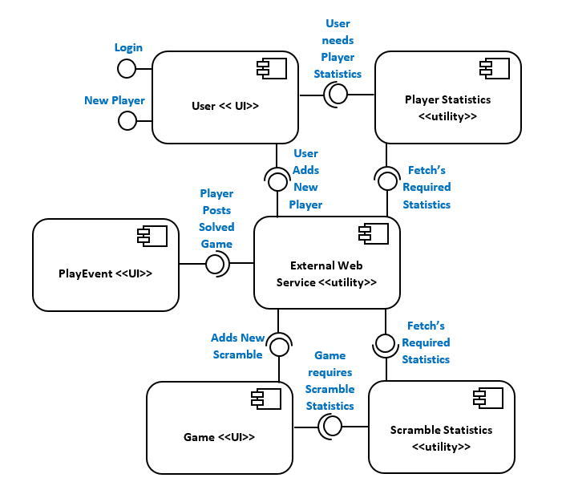
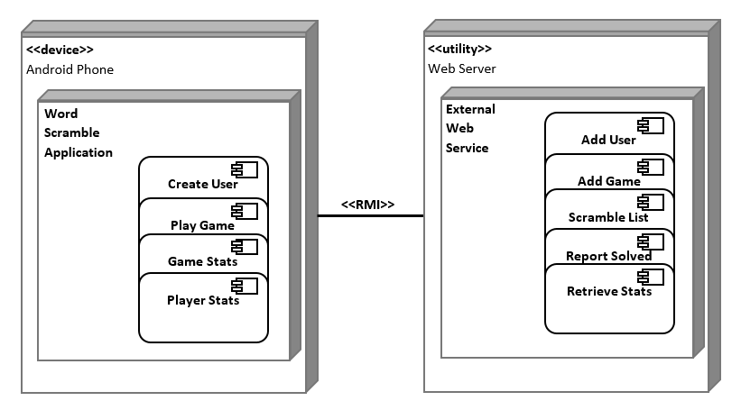
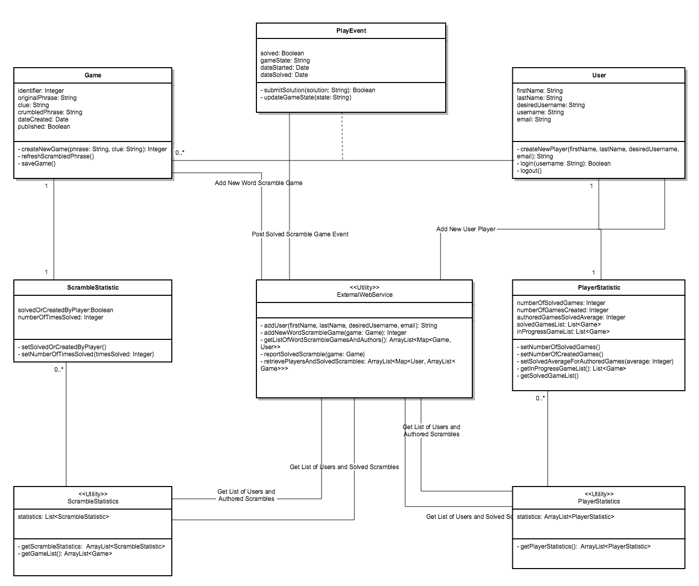
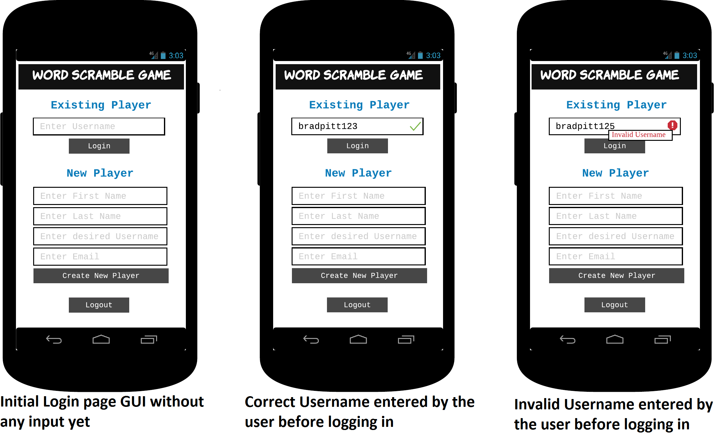
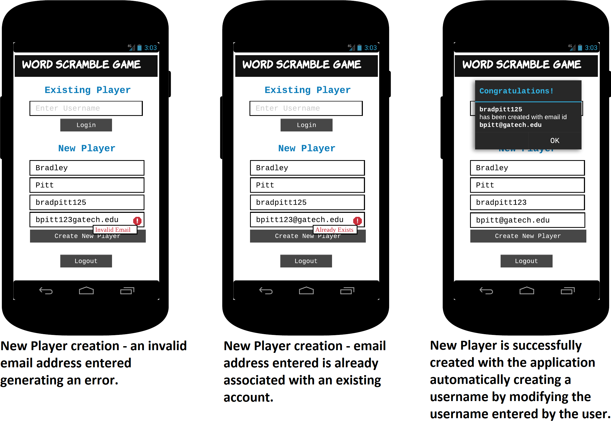
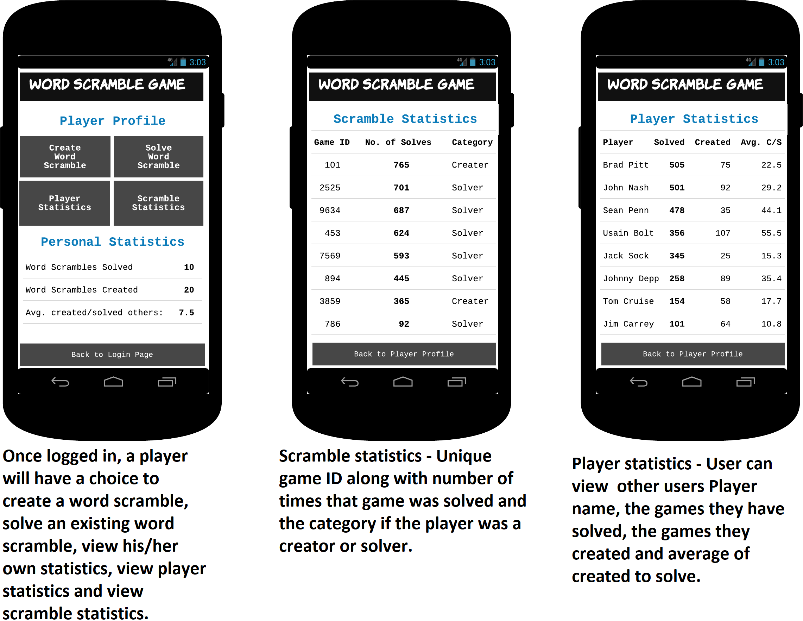
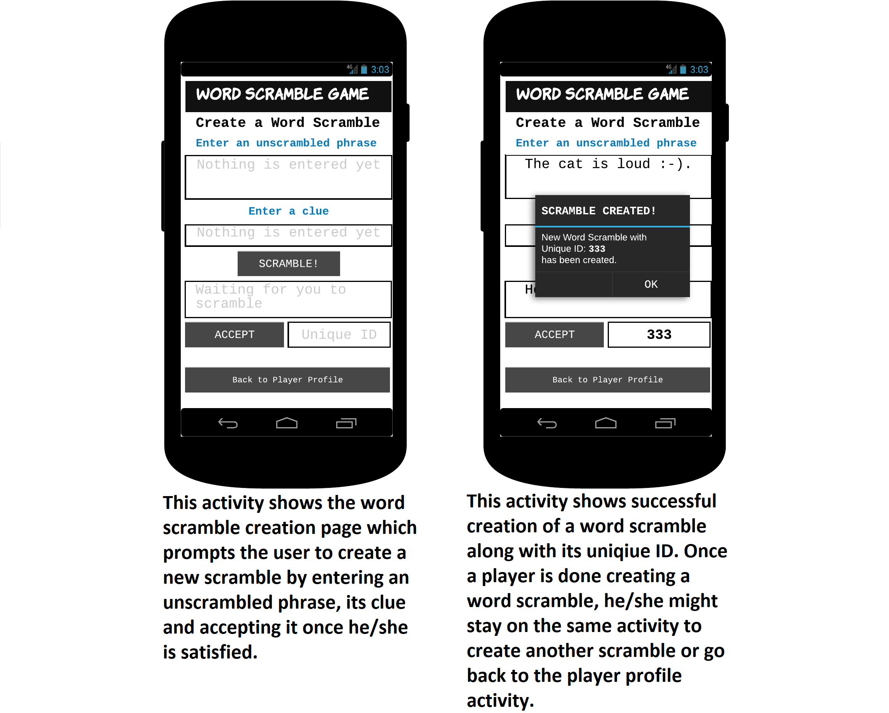
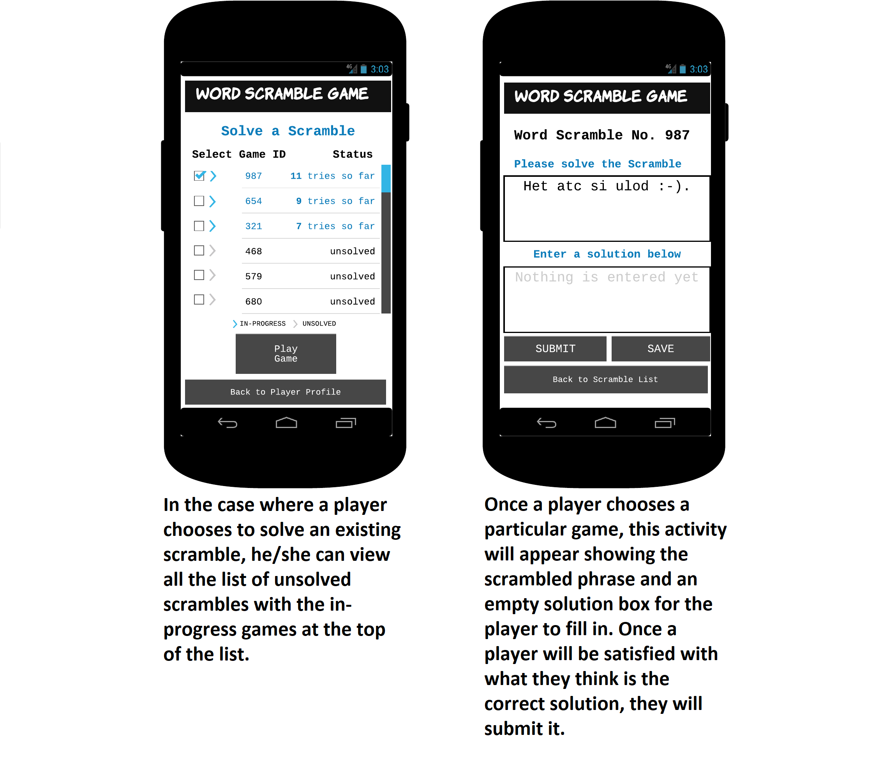
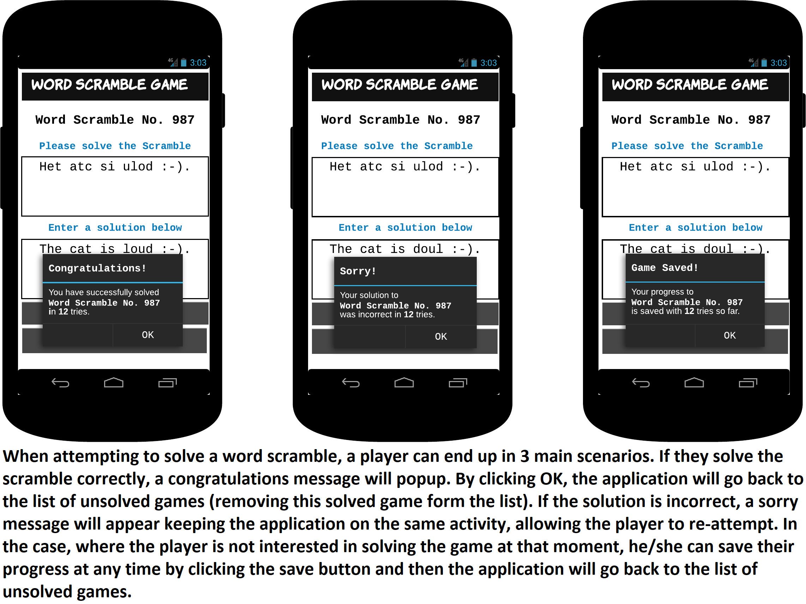

# Design Document

<!-- *This is the template for your design document. The parts in italics are concise explanations of what should go in the corresponding sections and should not appear in the final document.* -->

**Author**:  Team 47 

| Name | GT email ID |
| :-----: | :----------------- |
| Isaac Silva | ```isilva6@gatech.edu``` |
| Mukul Pai | ```mpai8@gatech.edu``` |
| Saad Khan | ```skhan315@gatech.edu``` |

**Document Tracking**: Following chart is used to log all the changes made to this document.

| Version | Date of edit/change | Who made the edit/change | Description of edit/change |
| :-----: | :-----------------: | :----------------------: | :------------------------ |
|    v1.0     |    10/06/2017                 |   Team 47                       |           *first draft*                 |
|    v1.1     |    10/13/2017                 |   Team 47                       |           *second draft*                 |
|    v1.2     |    10/20/2017                 |   Team 47                       |           *Updating the document after better understanding of the system.*                 |


## 1 Design Considerations

<!-- *The subsections below describe the issues that need to be addressed or resolved prior to or while completing the design, as well as issues that may influence the design process.* -->

This section contains all of the assumptions, system dependencies and constraints that were considered during the design of each subsystem and component of the Word Scramble application.

### 1.1 Assumptions
<!-- *Describe any assumption, background, or dependencies of the software, its use, the operational environment, or significant project issues.* -->

This section enumerates all the assumptions that impacted the Word Scramble application design.

| **No.** | **Description** |
| :---: | :--- |
|1. | The Word Scramble android game will be designed as a client/server application and will utilize the external web service (EWS) utility in order to communicate back and forth between the client (user/player) and the server. |
|2. | As per the UML design requirements, authentication is optional so the application will only require a unique username for a particular player to login.|
|3. | The intention of the application development team is that all the deliverables pertaining to development of the application will be distributed in an appropriate and prompt way.|
|4. | It is also intended that the test plan will account for all the various functionalities pertaining to the word scramble application.|
|5. | Private team GitHub repository assigned by Georgia Tech will be used to handle version control for the group project.|
|6. | To start the application, the user will have to create a new player profile in order to access the game. This can be done by providing initial user credentials, first naem, last name, email address and a desired user id.|
|7. | Username required for logging into or for creating a new player profile shall only contain alphabets and/or numerical characters and EWS will append to random numbers in order to preserve uniqueness.|
|8. |The game will be able to accept infinite number of scrambles associated with a particular player. |
|9. |A valid word scramble will be the one where each alphabet must be replaced at its position. None of the letters in the phrase should be left unscrambled.|
|10. |The application will allow a player to save scrambles with same unscrambled phrase but may have different clues. These will be treated as separate scrambles|
|11. | The application will use a flat text based approach to take user input for the original phrase, solution phrase and the clue.| 


### 1.2 Constraints

<!-- *Describe any constraints on the system that have a significant impact on the design of the system.* -->

| **No.** | **Description** |
| :---: | :--- |
|1. |Scramble application will be programmed using Android Studio version 2.2.|
|2. |If programming outside of Android Studio is necessary, IntelliJ Idea IDE with Java version 1.8 will be used where required.|
|3. |Team will try to deliver the project within the allotted time period.|
|4. |Huge amounts of data shall not be stored on the application (android phone).|
|5. |Internet access should be available for the application to execute properly.|

### 1.3 System Environment

<!-- *Describe the hardware and software that the system must operate in and interact with.* -->

| **No.** | **Description** |
| :---: | :--- |
|1. |Scramble application will be created with a minimum targeted sdk version of 19, i.e. application will be operational under API level 19.|
|2. |Fully working application should be able to run at default screen resolutions on standard android phones.|
|3. |At software testing level, application will be tested on Nexus 4 API 26 (Android 8.0, API 26) or similar Android Emulator.|


## 2 Architectural Design

<!-- *The architecture provides the high-level design view of a system and provides a basis for more detailed design work. These subsections describe the top-level components of the system you are building and their relationships.* -->

This section of the design document describes the architectural design for the Scramble application and intends to briefly explain the details of the design and the design process.

### 2.1 Component Diagram

<!-- *This section should provide and describe a diagram that shows the various components and how they are connected. This diagram shows the logical/functional components of the system, where each component represents a cluster of related functionality. In the case of simple systems, where there is a single component, this diagram may be unnecessary; in these cases, simply state so and concisely state why.* -->



| **No.** | **Component** | **Description** |
| :---:| :---: | :--- |
|1. | External Web Service| Provides a way to add new players, report solved games and provide player and game statistics.|
|2. | User | Allows to create a new player, create a new game, play an existing game and view player statistics.|
|3. | Player Statistics| Helps a particular player to view other player statistics.|
|4. | Play Event| Allows an existing user to play a game that already exists in the system.|
|5. | Game| Provides a way to fetch scramble statistics and to add a new game.|
|6. | Scramble Statistics| Helps user view statistics pertaining to a particular scramble.|

### 2.2 Deployment Diagram

<!--*This section should describe how the different components will be deployed on actual hardware devices. Similar to the previous subsection, this diagram may be unnecessary for simple systems; in these cases, simply state so and concisely state why.* -->



The Scramble game is a very simple application as most of the communication takes place between the android device and an external web service. The application itself will reside inside an android device/phone while the external web service utility exists separately. 

## 3 Low-Level Design

<!--*Describe the low-level design for each of the system components identified in the previous section. For each component, you should provide details in the following UML diagrams to show its internal structure.*-->

This section covers the design of the system components in form of a UML diagram.

### 3.1 Class Diagram

<!--*In the case of an OO design, the internal structure of a software component would typically be expressed as a UML class diagram that represents the static class structure for the component and their relationships.*-->



The final UML class diagram is shown above, which is an enhanced version of team design submitted as part of deliverable 1 and is based on the individual UML class diagram created by one of the team members.

### 3.2 Other Diagrams

<!--*<u>Optionally</u>, you can decide to describe some dynamic aspects of your system using one or more behavioral diagrams, such as sequence and state diagrams.*-->

At the time of this deliverable, there are no behavioral or state diagrams that show dynamic aspects of the system. These diagrams might be added to the design document if there is such a requirement during design progression.

## 4 User Interface Design
<!--*For GUI-based systems, this section should provide the specific format/layout of the user interface of the system (e.g., in the form of graphical mockups).*-->

### 4.1 Final User Interface Design

This section of the design document highlights the final user interface design for the Scramble application. These are snapshots from the final implementation of the application.

#### 4.1.1 Login GUI Scenarios



#### 4.1.2 New Player Creation GUI Scenarios



#### 4.1.3 Player Profile GUI Scenarios



#### 4.1.4 Create Game GUI Scenarios



#### 4.1.5 Play Game GUI Scenarios



#### 4.1.6 Play Game Outcome GUI Scenarios



## 5 Local Persistent Store

The Word Scramble game will require a local persistent store in order to store the game and user sessions. In order to accomplish that, Android's SQlite database will be used. In addition, an Object Relational Mapping (ORM) library might be deployed in order to seamlessly map the application's data model, described under the 3.1 section, into SQL.

