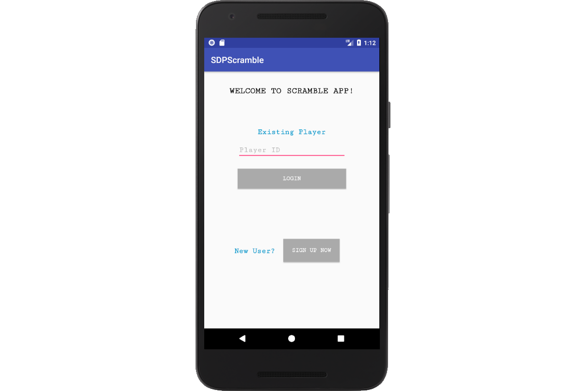
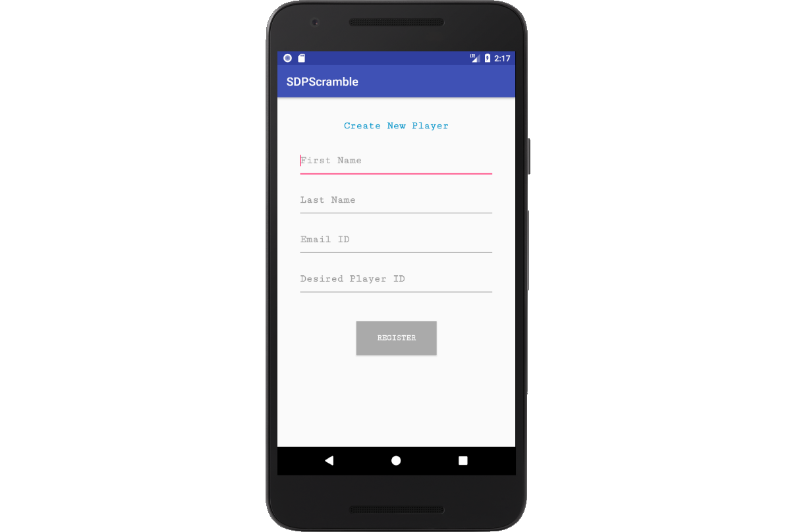
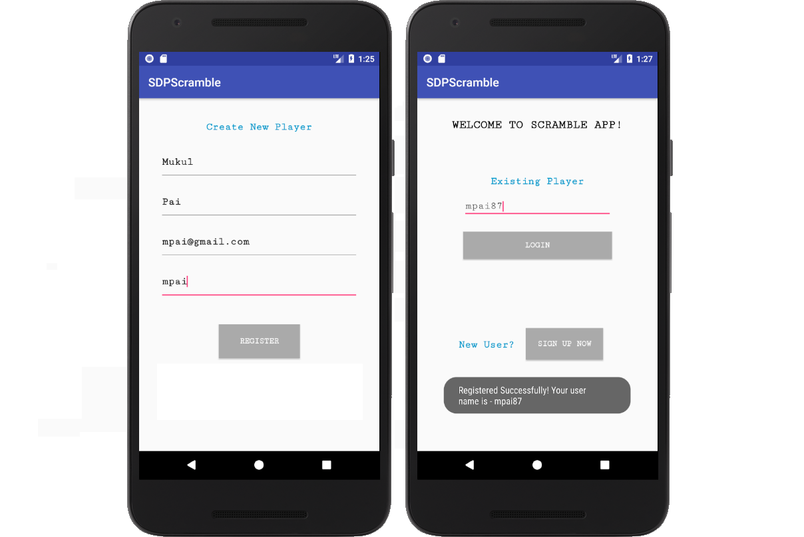
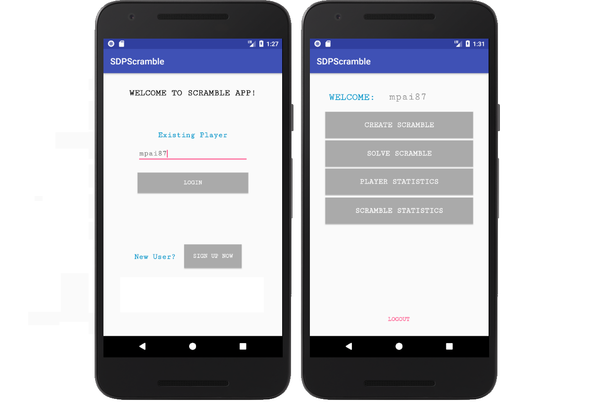
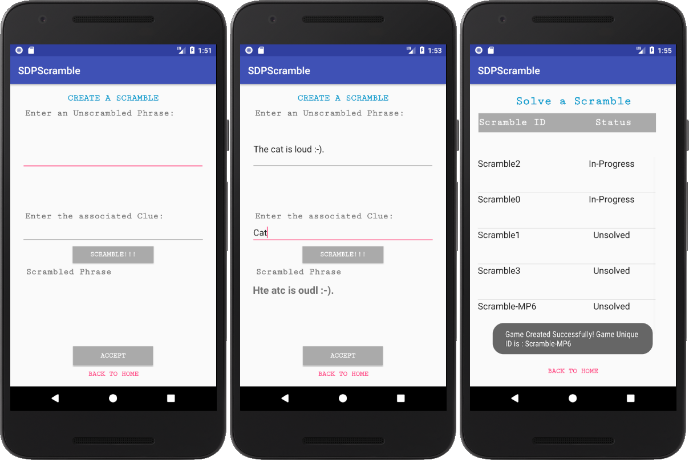
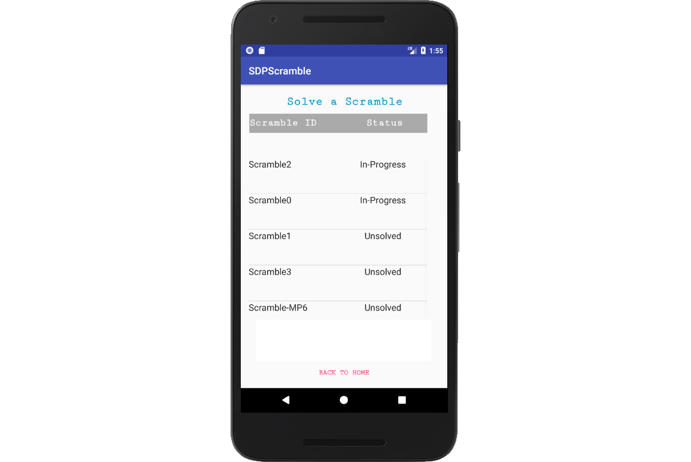
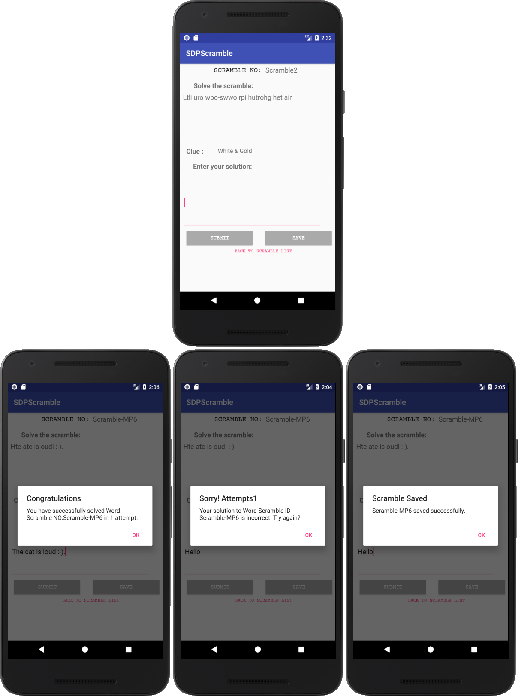
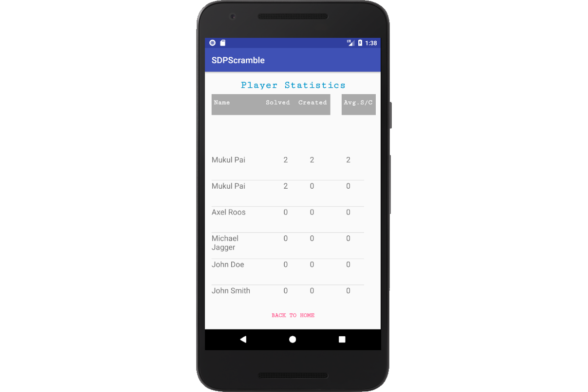
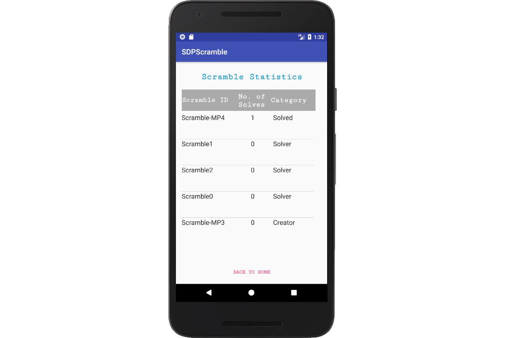

# CS6300 SDP Fall 2017 - Group Project

# Scramble Game - User Manual

**Author**:  Team 47 

| Name | GT email ID |
| :-----: | :----------------- |
| Isaac Silva | ```isilva6@gatech.edu``` |
| Mukul Pai | ```mpai8@gatech.edu``` |
| Saad Khan | ```skhan315@gatech.edu``` |

**Document Tracking**: Following chart is used to log all the changes made to this document.

| Version | Date of edit/change | Who made the edit/change | Description of edit/change |
| :-----: | :-----------------: | :----------------------: | :------------------------ |
|    v1.0     |    10/13/2017                 |   Team 47                       |           *for the Beta Version*                 |
|    v1.1     |    10/20/2017                 |   Team 47                       |           *for the Final Version*                 |

## Introduction

The SDPScramble Mobile Application is intended to help its users an opportunity to be occupied in their endless free time by offering numerous word scrambles to create, solve and compare their progress with each other. While using the application, you will be able to:

* Create a new user profile
* Create word scrambles
* Choose to solve existing scrambles
* Choose to save your progress on a particular scramble
* Able to view your and other player statistics
  * No. of scrambles created
  * No. of scrambles solved
  * Avg. no. of times a scramble created by you is solved by others
* Able to view your and Scrambles statistics
  * How many times was a particular scramble solved
  * Are you a creator or a solver of a particular scramble

## Running SDPScramble

The SDPScramble application is built in Android Studio with minimum API level set at 19 and maximum set at 26. To run the application, simply run the android emulator from within Android Studio.

## Application Login

After launching the application using android emulator, you will have one of two options to move forward. You can either enter a username associated with a user profile that already exists in the system or choose to create a new user profile as shown in Figure 1.

* If you need to create a new user profile, click **SIGN UP NOW** next to **New User?**
* For an existing user, enter the username in the test box under **Existing Player** and click **LOGIN**

**Figure 1: Application Login page**



## Create New Player

Once you click on the **SIGN UP NOW** button, application will take you to the Create New Player page as shown in Figure 2. Here you will be able to create a new player by providing the following:

* First name
* Last name
* Valid email address
* Desired username

**Figure 2: New Player creation page**



When all boxes are filled appropriately and you can click on the **REGISTER** button to register as a new user. The application will automatically append random numeric characters at the end of your desired username to keep it unique within the system. You will prompted with message on the screen showing you the username that was created and you will taken back to the application login page with the new username autofilled in the username text and ready to be logged in. This is shown below in Figure 3. 

**Figure 3: New Player creation confirmation**



## Existing Player Homepage

In the case when you have an existing profile or have now just created a user profile and have filled in the username on the login page and clicked on the **LOGIN** button, you will end up on the player homepage and will be greeted with your username. As shown in Figure 4, here you will have 4 options to choose from:

* Create Scramble
* Solve Scramble
* Player Statistics
* Scramble Statistics

**Figure 4: Player Homepage**



## Creating a  Scramble

If you choose to create scramble, you will be taken to the 'Create Scramble' page. Here you will have 2 text boxes to put in the following information:

* Unscrambled Word/Phrase
* Clue for this unscrambled word/phrase

Once you are done filling these text boxes, you can click on the button that says **SCRAMBLE!!!**. This would scramble the word/phrase for you. You can choose to re-click this button as many times as you wish and once you are satisfied with the scrambled word/phrase you can then choose to accept it by click on the **ACCEPT** button. This would save the scramble showing you the unique ID systems has assigned to it. This screen is shown below in Figure 5.

**Figure 5: Scramble creation**




## Solve a Scramble

In order for you to solve an already created scramble, you can click the 'Solve Scramble' button on the player homepage screen in Figure 4. This will take you to the scramble list screen as shown in Figure 6. Here you can choose the scramble you wish to solve by cicking on it.

**Figure 6: Scramble list**



After clicking on the scramble you choose to solve, you will be able to view the 'Solve Scramble' screen as shown in Figure 7. Here you can enter a probable solution to the scrambled word/phrase and attempt to solve it infinite no. of times. Here you will 2 options once you have filled in the solution, either to submit it by clicking the **SUBMIT** button or save your progress up until that point by clicking the **SAVE** button.

**Figure 7: Solving a Scramble**




## Viewing Player Statistics 

The 3rd option on the player homepage is for viewing player statistics by clicking the **PLAYER STATISTICS** button as shown in Figure 4. As shown in Figure 8, on this screen, you will be able to view the following statistics pertaining to each user:

* No. of scrambles created by a player
* No. of scrambles solved by a player
* Avg. no. of times a scramble created by a player is solved by others

**Figure 8: Player Statistics**



## Viewing Scramble Statistics

Last option on the player homepage is for viewing scramble statistics by clicking the **SCRAMBLE STATISTICS** button as shown in Figure 4. As shown in Figure 9, on this screen, you will be able to view the following statistics pertaining to each scramble created:

* How many times was a particular scramble solved
* Are you a creator or a solver of a particular scramble

**Figure 9: Scramble Statistics**




## Maneuvering around the Application

Moving back from a particular screen is intuitive and can be done in multiple ways when you are at a particular screen. You can either use the conventional method by clicking the standard back arrow on the android phone or you can click on the magenta colored back options provided on each application screen such as **LOGOUT** on the homepage screen, **BACK TO HOME** on the 'Create a Word Scramble', 'Solve a Scramble', 'Player Statistics' and the 'Scramble Statistics' screens and the **BACK TO SCRAMBLE LIST** while on the screen where you are solving a scramble.


## Contact US

* Isaac Silva ```isilva6@gatech.edu``` 
* Mukul Pai ```mpai8@gatech.edu``` 
* Saad Khan ```skhan315@gatech.edu``` 
