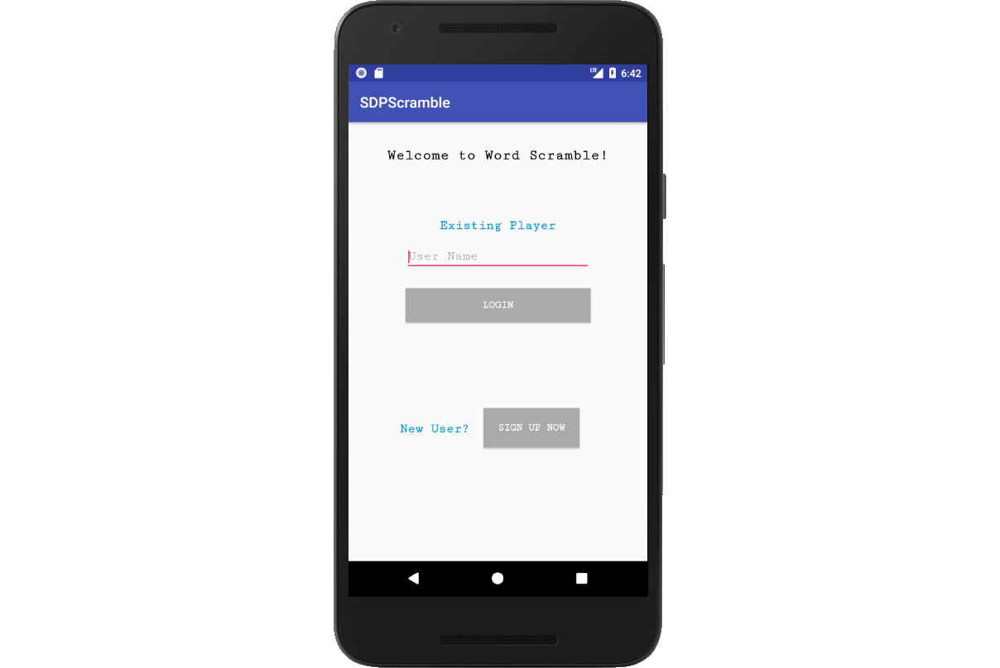

# CS6300 SDP Fall 2017 - Group Project

# Word Scramble Game - User Manual

**Author**:  Team 47 

| Name | GT email ID |
| :-----: | :----------------- |
| Isaac Silva | ```isilva6@gatech.edu``` |
| Mukul Pai | ```mpai8@gatech.edu``` |
| Saad Khan | ```skhan315@gatech.edu``` |

**Document Tracking**: Following chart is used to log all the changes made to this document.

| Version | Date of edit/change | Who made the edit/change | Description of edit/change |
| :-----: | :-----------------: | :----------------------: | :------------------------: |
|    v1.0     |    10/13/2017                 |   Team 47                       |           *first draft*                 |

## Introduction

The SDPScramble Mobile Application is intended to help its users an oppotunity to be occupied in their endless free time by offering numerous word scrambles to create, solve and compare their progress with each other. While using the application, you will be able to:

* Create a new user profile
* Create word scrambles
* Choose to solve existing scrambles
* Choose to save your progress on a particular scramble
* Able to view your and other player statistics
  * No. of scrambles created
  * No. of scrambles solved
  * Avg. no. of times a scramble created by you is solved by others
* Able to view your and Scrambles statistics
  * How many times was a particular scramble was solved
  * Are you a creator or a solver of a particular scramble


The SDPScramble application gives its users an oppotunity to be occupied in their endless free time by offering numerous word scrambles to create, solve and compare their progress with each other. Existing users can dive right in and start by creating new word scrambles, choose to solve new scrambles created by others or continue with the ones they had left in-progress during previous sessions. New users can do all this as well by creating a new user profile at the beginning. The application maintains, user profiles with unique usernames along with the scrambles each user created and solved and their performance on solving scrambles created by others. It also maintains scramble records enabling users to view that how many times a paritcular scramble was solved. For every word scramble game, the user will be able to view a scrambled word and will have an input text box below to type in a probable solution and try to solve it. User will can have multiple attempts to solve it, either stopping if they get a correct solution or leaving the game in-progress to have an attempt later on.

## Running SDPScramble

The SDPScramble application is built in Android Studio with minimum API level set at 19 and maximum set at 26. To run the application, simply run the android emulator from within Android Studio.

## Application Login

After launching the application using android emulator, you will be will have one of two options to move forward. You can either enter a username associated with a user profile that already exists in the game or choose to create a new user profile.

                                                     **Figure 1: Application Login**





## Using SDPCryptogram

Upon launching SDPCryptogram, you will be presented with a login screen. Both administrators and players can use this screen to login, and the app will detect the type of user automatically and log them into the appropriate home screen.

A valid administrator username/password combination is **"admin"/"Password"** (without quotes). <br>
A valid player username/password combination is **"david"/"Password"** (without quotes).

Usernames and password are case-sensitive and may only contain alphanumeric characters.

The administrator home screen includes three options: **Add Player**, **Add Cryptogram**, and **Edit Cryptogram**.
* **Adding Players**: The administrator inputs each new player's first and last names, username, and password. After creation, this user information cannot be edited or changed by the administrator or the user.
* **Adding Cryptograms**: The administrator can add a cryptogram by simply providing the solution and encoded phrases. Only encoded phrases for which very alphabetic character is shifted by the same number of positions in the alphabet (Caesar cipher or shift cipher) will be allowed when creating cryptograms. Additionally, cryptograms with same solution and encoded phrases (shift by 0 positions) will not be allowed, and neither will cryptograms which include changes to non-alphabetical characters.
* **Editing Cryprograms**: The administrator can edit any previously created cryptogram at any time by inputting that cryptogram's unique ID. Changes to cryptogram phrases must adhere to the same rules outlined above for creating new cryptograms.

The player home screen includes two options: **Choose Cryptogram** and **Player Ratings**.
* **Choosing Cryptograms**: Players may select cryptograms from a list of all current cryptograms, including those started, solved, and not started. For each cryptogram in the list, a standard set of information will be displayed. The encoded phrase will be shown and will scroll horizontally if too long to display in the allotted area. To the right of the encoded phrase, the Unique ID will be shown. Below these fields will be an indicator if the player has solved the cryptogram and the number of incorrect submissions (if any). Touching a cryptogram in the list will take the player to the Solve Cryptogram screen. On this screen, the encoded phrase will be shown at the bottom and the player will be able to type in their guess at the solution phrase above it. If the player inputs any text into the solution phrase entry area and then leaves the screen without touching Solve, their progress will be saved and the cryptogram will be registered as "started." If the player is happy with their solution, they can press Solve to check it. They will receive confirmation that the solution is either correct or incorrect, and their ratings will be updated to reflect this result.
* **Viewing Player Ratings**: Players may view a list of player ratings for all remote and local players at any time. The list of player ratings will be similar in format to the list of cryptograms. For each player, their first and last name will be displayed in bold, along with their number of solved and started cryptograms as well as the total number of incorrect solutions they have submitted. Players will be ranked by total number of cryptograms solved, with the most being displayed at the top and in descending order. Touching player entries in the list will not lead to any additional information.

Navigation: Navigation in SDPCryptogram is intended to be intuitive and buttons easy to understand and use. The standard Android **Back** button can be used to navigate to previous screens when no explicit button is provided for navigation. Furthermore, the "three dot" menu symbol at the top right of every screen can be touched to display a **logout** option that will take the user back to the login page to allow switching between users.

## Built With

* [Gradle](https://gradle.org/) - Dependency Management
* [Andorid Bootstrap](https://github.com/Bearded-Hen/Android-Bootstrap) - Used for front end design

## Authors

* **Michael Amadasun** - *User Interface Software Developer*
* **Alexander Molnar** - *Application Tester*
* **Muzammil Mueen** - *Application Software Developer*
* **David Nelson** - *Application Designer/Documentation Lead*
